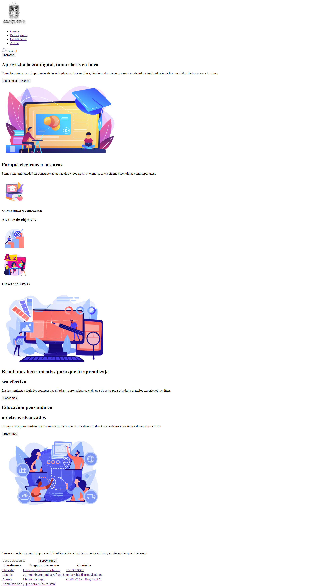
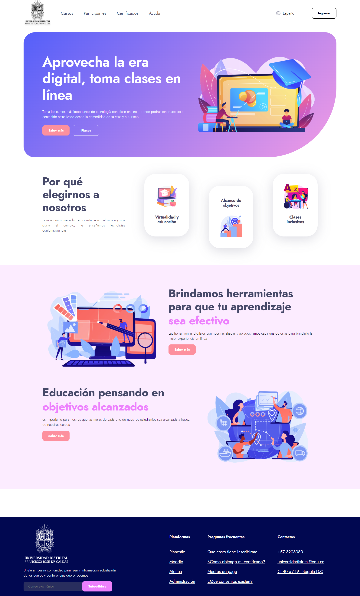
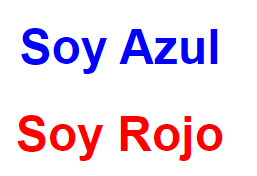
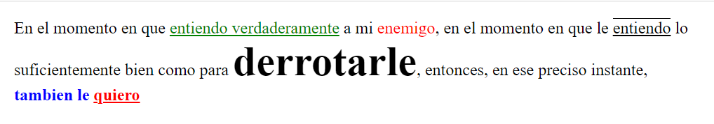
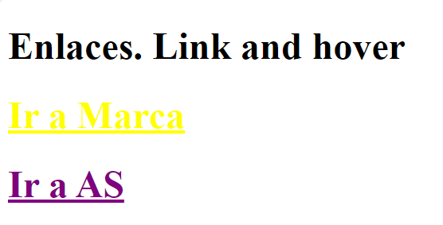
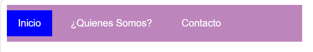
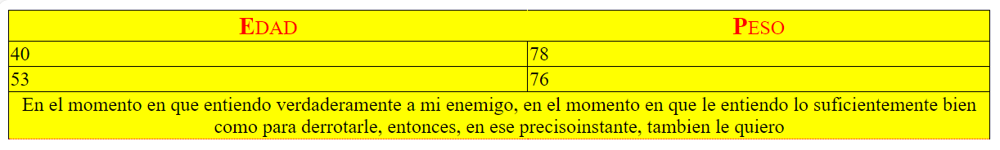

<h1>Taller 9 Johann Alexis Delgado Carvajal</h1>

<h2> Información</h2>

Curso: full Stack Basico - Grupo 1

Profesor: Cristian Patiño

<h3>Link Página Web</h3>
<a href="https://joadelgadoca.github.io/taller-3-full-stack/" target="_blank">Link Pagina web </a>

<h2> Punto 1: Link figma</h2>

<a href="https://www.figma.com/file/gmIIfStbHfqz5bvYYjheEU/Johann-Alexis-Delgado-Carvajal?type=design&node-id=0%3A1&mode=design&t=xJjd3pS3wNauDYLU-1" target="_blank">Link de Figma</a>

<h2> Punto 2: HTML del diseño</h2>

<h2> Punto 3: CSS del diseño</h2>

<h2> Punto 4: Titulos</h2>

<h2> Punto 5: Parrafo</h2>

<h2> Punto 6: Links</h2>

<h2> Punto 7-8: Navegación</h2>

<h2> Punto 9: Tablas</h2>

